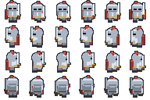

<div align="center">

# 🎨 Aseprite MCP Server

**Let AI draw pixel art in Aseprite**

A Model Context Protocol (MCP) server that enables AI to create pixel art in Aseprite through pixel-level drawing primitives, read canvas screenshots, and iterate until satisfied.

[](https://www.python.org/)
[](https://github.com/jlowin/fastmcp)
[](https://aseprite.org/)
[](https://github.com/ZhangDongyang800/Aseprite_MCP/stargazers)

<p align="center">
  <a href="README_CN.md">🇨🇳 简体中文</a>
</p>

</div>

<br>

> [!IMPORTANT]
> This project requires a local installation of [Aseprite](https://aseprite.org/) v1.3+. AI performs drawing via the MCP protocol by calling the Aseprite CLI + Lua scripts.
>
> Two execution modes are supported:
> - **CLI mode** (default): Each tool call spawns a headless Aseprite process (`aseprite -b`). No UI, state passed via `.ase` files.
> - **Live mode** (WebSocket): AI operates the running Aseprite instance directly through a WebSocket bridge. UI is visible, state is persistent, and you can watch AI draw in real time. See [Live Mode Setup](#-live-mode-optional-websocket) below.


---

##  Table of Contents

- [ How to Use](#-how-to-use)
- [ Live Mode (Optional, WebSocket)](#-live-mode-optional-websocket)
- [ What It Can Do](#-what-it-can-do)
- [ Demo](#-demo)
- [ Contributing](#-contributing)
- [ License](#-license)

---

##  How to Use

### 1. Environment Setup

Before configuring MCP, prepare your local development environment:

| Dependency | Version | Download |
|------------|---------|----------|
| Python | 3.10+ | [python.org](https://www.python.org/downloads/) |
| Aseprite | v1.3+ | [aseprite.org](https://aseprite.org/) (remember the install path) |

### 2. MCP Server Setup

```bash
git clone https://github.com/ZhangDongyang800/Aseprite_MCP.git
cd Aseprite_MCP
pip install -e .
```

This installs `fastmcp` and `websockets` (the latter is required for optional [Live Mode](#-live-mode-optional-websocket)).

### 3. Client Configuration

> [!IMPORTANT]
> Replace the paths below with your actual local paths:
> - Path to `server.py` in `args`
> - `ASEPRITE_PATH` environment variable value
> - `python` path in `command`

**TRAE:**

Open TRAE → Settings → MCP → Add MCP Server, paste:

```json
{
  "mcpServers": {
    "aseprite": {
      "command": "python",
      "args": ["C:\\path\\to\\Aseprite_MCP\\server.py"],
      "env": {
        "ASEPRITE_PATH": "C:\\Program Files\\Aseprite\\aseprite.exe"
      }
    }
  }
}
```

**Codex CLI:**

Config file: `~/.codex/config.toml`

```toml
[mcp_servers.aseprite]
command = "python"
args = ["/path/to/Aseprite_MCP/server.py"]

[mcp_servers.aseprite.env]
ASEPRITE_PATH = "C:\\Program Files\\Aseprite\\aseprite.exe"
```

After configuration, ask your AI tool to use Aseprite-related tools to start creating.

---

## 🎥 Live Mode (Optional, WebSocket)

Live mode lets AI operate your **running Aseprite instance** directly — you can watch every stroke happen in real time on your screen, and the sprite state persists across tool calls (no repeated file open/save overhead).

### How It Works

```
┌─────────┐    MCP (stdio)    ┌──────────────┐   WebSocket    ┌──────────────────┐
│  AI/TRAE │ ───────────────► │ Python MCP   │ ─────────────► │ Aseprite Extension│
│          │ ◄─────────────── │ Server       │ ◄──────────── │ (WebSocket client) │
└─────────┘                   └──────────────┘                └──────┬───────────┘
                                                                     │ Lua app.* API
                                                                     ▼
                                                              ┌──────────────┐
                                                              │ Visible Aseprite │
                                                              │ Sprite + UI      │
                                                              └──────────────┘
```

The Python MCP server starts a WebSocket server on `127.0.0.1:9001`. The Aseprite extension connects to it as a client. Each MCP tool call is forwarded to Aseprite over WebSocket, executed via the existing Lua scripts, and the result is sent back.

### Setup

**1. Install the Aseprite extension**

The extension is in the `extension/` folder of this repo. Install it via:

- Open Aseprite → `File > Scripts > Open Scripts Folder`
- Copy the entire `extension/` folder contents into the scripts folder (or use `Edit > Preferences > Extensions > Add Extension` and select the `extension/` folder)

**2. Enable WebSocket mode in MCP config**

Add `ASEPRITE_MCP_MODE=ws` to the `env` section of your MCP server config:

```json
{
  "mcpServers": {
    "aseprite": {
      "command": "python",
      "args": ["C:\\path\\to\\Aseprite_MCP\\server.py"],
      "env": {
        "ASEPRITE_PATH": "C:\\Program Files\\Aseprite\\aseprite.exe",
        "ASEPRITE_MCP_MODE": "ws",
        "ASEPRITE_WS_HOST": "127.0.0.1",
        "ASEPRITE_WS_PORT": "9001"
      }
    }
  }
}
```

**3. Connect Aseprite**

With the MCP server running, open Aseprite and click:

`File > Scripts > MCP Bridge: Toggle Connection`

You should see an alert: "MCP Bridge: Connected to ws://127.0.0.1:9001".

Now AI can operate Aseprite directly — create a sprite, draw pixels, and you'll see it happen live.

### CLI vs Live Mode Comparison

| Aspect | CLI Mode (default) | Live Mode (WebSocket) |
|--------|-------------------|----------------------|
| UI visibility | Headless (`-b` flag) | Full UI, watch AI draw |
| State persistence | Per-call (file-based) | Persistent across calls |
| Startup overhead | New process per call | Single running instance |
| Setup complexity | None | Install extension + connect |
| Aseprite focus required | No | Yes (callbacks delayed when unfocused) |
| Fallback | N/A | Auto-falls back to CLI if extension not connected |

> [!TIP]
> If the Aseprite extension is not connected, Live mode tools return a clear error message guiding you to connect. The existing CLI mode is always available as fallback by setting `ASEPRITE_MCP_MODE=cli` (or removing the variable).

### Environment Variables

| Variable | Default | Description |
|----------|---------|-------------|
| `ASEPRITE_MCP_MODE` | `cli` | Execution mode: `cli` or `ws` |
| `ASEPRITE_WS_HOST` | `127.0.0.1` | WebSocket server bind address |
| `ASEPRITE_WS_PORT` | `9001` | WebSocket server port |

---

##  What It Can Do

Let AI create pixel art in Aseprite like a human artist — with a complete workflow supporting pixel-level drawing, multi-layer management, animation frame editing, palette control, animation tags, image transforms, selection editing, color adjustments, filters, gradients, batch operations, and canvas preview. **67+ tools** in total.

###  Pixel-Level Drawing

All drawing tools support `layer` and `frame` parameters, allowing drawing on a specific layer and frame (default: layer 1, frame 1).

| Tool | Description |
|------|-------------|
| `draw_pixel` | Draw a pixel at specified coordinates |
| `draw_line` | Draw a straight line |
| `draw_rect` | Draw a rectangle (outline / filled) |
| `draw_ellipse` | Draw an ellipse (outline / filled) |
| `fill_region` | Paint bucket fill a connected region |
| `clear_region` | Clear a region to transparent |
| `clear_canvas` | Clear the entire canvas |

###  Sprite Management

| Tool | Description |
|------|-------------|
| `create_sprite` | Create a new canvas (supports `rgb` / `grayscale` / `indexed` modes) |
| `open_sprite` | Open an existing `.ase` or `.png` file |
| `save_sprite` | Save as `.ase` / `.png` / `.gif` |
| `close_session` | Close the session and clean up temporary resources |
| `import_png` | ★Recommended★ Import an image from a PNG file — the most token-efficient way to draw arbitrary shapes. Two modes: `new` (create a new session from the PNG, auto-reads real dimensions) / `stamp` (paste the PNG onto an existing session at a given layer/frame/offset). Recommended workflow: generate a PNG with Python/PIL, call `import_png(mode="new")`, then refine with `draw_pixel` / `draw_rect` etc. |

###  Animation & Frames

| Tool | Description |
|------|-------------|
| `add_frame` | Add a new frame (copy last or create empty) |
| `remove_frame` | Remove a specific frame |
| `set_frame_duration` | Set frame duration (seconds) |
| `get_frame_info` | Get all frame info (count, duration per frame) |
| `export_gif` | Export GIF animation (supports scaling) |
| `export_sprite_sheet` | Export sprite sheet (PNG + JSON data) |

###  Layer Management

| Tool | Description |
|------|-------------|
| `add_layer` | Create a new layer |
| `remove_layer` | Remove a layer (by name or index) |
| `set_layer_properties` | Set layer properties (name, visibility, opacity, blend mode) |
| `get_layer_info` | Get info for all layers |
| `move_cel` | Move a cel between layers / frames |

###  Palette

| Tool | Description |
|------|-------------|
| `set_palette_color` | Set the color at a specific palette index |
| `get_palette` | Get all colors in the current palette |
| `resize_palette` | Resize the palette (number of colors) |
| `load_palette` | Load a palette from a file (`.gpl` / `.pal` / `.png`) |

###  Animation Tags

| Tool | Description |
|------|-------------|
| `add_tag` | Create an animation tag (supports playback direction, loop count) |
| `remove_tag` | Remove a tag by name |
| `get_tags` | Get info for all tags |

###  Image Transforms

| Tool | Description |
|------|-------------|
| `flip_canvas` | Flip canvas (horizontal / vertical) |
| `resize_sprite` | Resize the sprite |
| `rotate_canvas` | Rotate canvas (90° / 180° / 270°) |
| `crop_sprite` | Crop sprite to a specified region |
| `invert_color` | Invert all colors |
| `replace_color` | Replace a specific color |

###  Palette Enhancements

| Tool | Description |
|------|-------------|
| `apply_preset_palette` | ★Batch★ Apply a built-in preset palette (db16/db32/aap64/nes/gameboy) |
| `derive_shading_palette` | Derive a three-step shading palette from a base color (with hue shift, auto-applied by default) |
| `append_palette_colors` | ★Batch★ Append multiple colors to the palette |

###  Animation Helpers

| Tool | Description |
|------|-------------|
| `apply_timing_preset` | ★Batch★ Set frame durations in bulk by animation type |
| `draw_animation_frames` | ★Batch★ Draw multiple animation frames in one call |
| `export_onion_skin_preview` | Onion-skin overlay preview (compare adjacent frames) |

###  Tileset Tools

| Tool | Description |
|------|-------------|
| `create_tileset_canvas` | Create a tileset canvas and set up the grid |
| `export_tiled_preview` | Tiled layout preview (seam check) |

###  Quality Checks

| Tool | Description |
|------|-------------|
| `export_silhouette` | Export a solid black silhouette (silhouette test) |
| `check_canvas_standards` | Auto-check canvas standards (size / colors / frame duration / pixel art) |

###  Canvas Inspection

| Tool | Description |
|------|-------------|
| `get_canvas_preview` | Export a PNG for AI visual analysis (**core iteration tool**) |
| `get_canvas_info` | Get canvas metadata (size, color mode, etc.) |
| `get_pixel_color` | Query the color of a pixel at specified coordinates |

### 🔲 Selection Editing (NEW)

Aseprite's core editing paradigm: select → modify → deselect.

| Tool | Description |
|------|-------------|
| `select_all` | Select entire canvas (Ctrl+A) |
| `deselect` | Clear selection (Ctrl+D) |
| `select_by_color` | Magic wand — select by color with tolerance |
| `invert_selection` | Invert current selection |
| `delete_selection` | Clear selected area to transparent (Delete key) |

### 🎨 Color Adjustments (NEW)

| Tool | Description |
|------|-------------|
| `adjust_colors` | Unified color adjustment: brightness/contrast/hue/saturation/lightness in one call |

### 🔧 Layer & Frame Operations (NEW)

| Tool | Description |
|------|-------------|
| `merge_down` | Merge layer down (Ctrl+E) |
| `flatten_layers` | Flatten all layers |
| `duplicate_layer` | Duplicate a layer |
| `duplicate_frame` | Duplicate a frame |

### ✨ Filters & Effects (NEW)

| Tool | Description |
|------|-------------|
| `apply_blur` | Box blur filter (radius 1-3) |
| `draw_gradient` | Linear/radial gradient fill |

### ⚡ Efficiency Tools (NEW)

| Tool | Description |
|------|-------------|
| `batch_edit` | ★ Execute multiple operations in ONE Aseprite call (N× efficiency in CLI mode) |
| `run_lua` | Execute arbitrary Lua code for full Aseprite API access (escape hatch) |
| `undo` | Undo last operation (Live mode: native; CLI mode: file backup restore) |
| `redo` | Redo undone operation (Live mode) |

###  Other Capabilities

- **MCP Resources** — Session list, default palette, canvas metadata, blend mode list, animation direction list
- **MCP Prompts** — Sprite creation guide, iteration review guide, animation creation guide, multi-layer workflow guide

> [!TIP]
> `get_canvas_preview` is the core of the workflow: after drawing, AI calls it to "see" the canvas, analyze it, and decide whether to fix it, forming a **draw → preview → analyze → fix** loop.

<br>

<div align="center">

**CLI Mode Data Flow** (default)

```
AI Request → MCP Tool Call → FastMCP (Python) → Aseprite CLI → Lua Script → .ase File
                                                                    ↓
AI Visual Analysis ← base64 PNG ← Image Object ← FastMCP ← export_png.lua ←─┘
```

</div>

---

##  Demo


**Example: Chibi Knight Walk Cycle**

<div align="center">

**Four-Direction Walk Animation**

| ↓ Down | ↑ Up |
|:---:|:---:|
|  |  |
| ← Left | → Right |
|  |  |

**Sprite Sheet**



</div>

**AI Prompt:**

> Use Aseprite MCP to generate a pixel art sprite sheet of a brave knight in silver armor holding a long sword. Four-direction walk cycle (down, up, left, right), 4 frames per direction, 32x32, flat colors, transparent background.

---

**Example: Import a PNG (Recommended Workflow for Arbitrary Shapes)**

When drawing complex or non-grid-friendly shapes, generating a PNG with Python/PIL and importing it is far more token-efficient than describing every pixel with `draw_from_grid` or hundreds of `draw_pixel` calls.

```python
# Step 1: Generate a PNG with Python/PIL
from PIL import Image, ImageDraw
img = Image.new("RGBA", (32, 32), (0, 0, 0, 0))      # transparent background
d = ImageDraw.Draw(img)
d.ellipse([4, 4, 27, 27], fill=(231, 76, 60, 255))    # draw a red circle
img.save("circle.png")
```

```python
# Step 2: Import the PNG into a new Aseprite session
import_png(png_path="circle.png", mode="new")
# Returns: { "session_id": "...", "width": 32, "height": 32, ... }
```

```python
# Step 3: Refine with pixel-level tools if needed
draw_pixel(session_id="...", x=16, y=6, color="#FFFFFF")   # add a highlight
```

Use `mode="stamp"` to paste a PNG onto an existing session at a specific layer/frame/offset — handy for adding details, stamps, or compositing sub-images.


---

## 🤝 Contributing

Issues and Pull Requests are welcome!

I've tried it, but I can't guarantee it works perfectly. It still needs more optimization.

---

##  License

This project is open-sourced under the [MIT License](LICENSE).

Copyright © 2026 [ZhangDongyang800](https://github.com/ZhangDongyang800)

<div align="center">

<sub>Built with ❤️ for pixel art lovers</sub>

</div>
