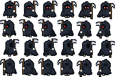

<div align="center">

# 🎨 Aseprite MCP Server

**让 AI 在 Aseprite 中绘制像素画**

一个模型上下文协议（MCP）服务器，让 AI 通过像素级绘制原语在 Aseprite 中创建像素画，读取画布截图，并不断迭代直至满意。

[](https://www.python.org/)
[](https://github.com/jlowin/fastmcp)
[](https://aseprite.org/)
[](https://github.com/ZhangDongyang800/Aseprite_MCP/stargazers)

<p align="center">
  <a href="README.md">English</a>
</p>

</div>

<br>

##  示例演示

三个角色都是 AI 通过本 MCP 现场绘制的像素素材：像素全部由 `apply_operations` 写入，
`run_lua` 只负责 op 面没有的结构工作（加帧、设时长、建 tag、导出精灵表）。

| 角色 | ↓ 下 | ↑ 上 | ← 左 | → 右 | 精灵表 |
|:--|:--:|:--:|:--:|:--:|:--:|
| **Q 版骑士**<br>4 方向 × 6 帧 |  |  |  |  |  |
| **暗黑死神**<br>4 方向 × 6 帧 |  |  |  |  |  |
| **黏液吞噬怪**<br>4 方向 × 5 帧动作 |  |  |  |  |  |

> 前两个是**行走循环**（骑士靠腿部反相摆动，死神没有腿、靠袍摆行波与骨脚读出迈步）；
> 第三个是**动作帧动画**：待机 → 蓄力 → 张口突进 → 咬合 → 吞咽，帧时长按相位变化。
> 每个角色的 `demo/<name>/generator/` 下都有可重跑的参数化生成器与逐帧像素校验脚本。

---

> [!IMPORTANT]
> 本项目需要本地安装 [Aseprite](https://aseprite.org/) v1.3+。AI 通过 MCP 协议调用 Aseprite CLI + Lua 脚本来执行绘制。
>
> 支持两种执行模式：
> - **CLI 模式**（默认）：每次工具调用启动一个无头 Aseprite 进程（`aseprite -b`）。无 UI，状态通过 `.ase` 文件传递。
> - **实时模式**（WebSocket）：AI 通过 WebSocket 桥接直接操作正在运行的 Aseprite 实例。UI 可见，状态持久化，你可以实时观看 AI 绘制过程。详见下方的[实时模式配置](#-实时模式可选-websocket)。


---

##  目录

- [ 示例演示](#-示例演示)
- [工具](#工具)
- [ 如何使用](#-如何使用)
- [ 实时模式（可选，WebSocket）](#-实时模式可选-websocket)
- [ 示例提示词](#-示例提示词)
- [ 参与贡献](#-参与贡献)
- [ 开源协议](#-开源协议)

---

## 工具

服务器只暴露三个 MCP 工具：

| 工具 | 说明 |
|------|------|
| `apply_operations` | 在单个事务中执行一批 op——唯一的变更入口。传入 `session_id` + `ops[]`；`dry_run=true` 只校验、不产生副作用；批次包含破坏性 op（`clear_canvas`、`close_session`）时必须传 `confirmed=true`。省略 `session_id` 且首个 op 为 `create_sprite` / `open_sprite` 时会自动创建会话。 |
| `inspect` | 只读感知：返回画布预览图与量化指标（调色板、颜色数、包围盒、覆盖率、半透明与孤立像素）。动画文档用 `frame=N` 逐帧查看。永不修改文档。 |
| `run_lua` | 逃逸舱：执行任意 Lua。需要 `unsafe=true` 且 `confirmed=true`。 |

op 是注册在 `src/v2/ops/` 中的命名操作（Pydantic 参数模型），其 Lua 实现位于 `scripts/ops_*.lua`。内置 op：`create_sprite`、`open_sprite`、`save_sprite`、`close_session`、`draw_pixel`、`draw_rect`、`fill_region`、`clear_canvas`、`undo`、`redo`，以及结构类的 `add_frames`、`set_durations`、`add_tag`、`paint_grid`。

`paint_grid` 接收一个 Lua 数据文件路径，文件返回 `{palette = {b = "#F0A65A"}, rows = {"..bb..", ...}}`，一个字符一个像素，`.` 表示透明。整张图的像素因此不必经过工具调用：32×32 四帧走 `paint_grid` 只花几百 token，走 `draw_pixel` 则是几万个；而且它和其他 op 一样有参数校验和事务回滚。

```python
apply_operations(ops=[
    {"op": "create_sprite", "width": 32, "height": 32},
    {"op": "draw_rect", "x": 4, "y": 4, "width": 24, "height": 24, "color": "#E74C3C", "filled": True},
    {"op": "draw_pixel", "x": 16, "y": 6, "color": "#FFFFFF"},
])
```

所有绘制 op 都接受 `layer` / `frame`（从 1 开始计数，默认 1/1）。一批 op 在单个 `app.transaction` 中执行，因此默认的 `atomic=true` 会在任意 op 失败时回滚整批。

> [!TIP]
> `inspect` 是工作流的核心：绘制后，AI 调用它来"看到"画布、分析它，并决定是否修正，形成 **操作 → 检查 → 分析 → 修正** 的循环。

---

##  如何使用

### 1. 准备

| 依赖 | 版本 | 说明 |
|------|------|------|
| [uv](https://docs.astral.sh/uv/) | 任意较新版本 | 由它代管 Python 和全部依赖 |
| Aseprite | v1.3+ | 记下**可执行文件**的完整路径，不是它所在的文件夹 |

安装 uv：Windows `winget install astral-sh.uv`，macOS `brew install uv`，或 `curl -LsSf https://astral.sh/uv/install.sh | sh`。

### 2. 克隆

```bash
git clone https://github.com/ZhangDongyang800/Aseprite_MCP.git
```

没有安装步骤：第 3 节的 `uv run` 会在首次启动时按 `pyproject.toml` 自动建好独立环境并装齐 `fastmcp` / `pillow` / `websockets`。

### 3. 客户端配置

把 `C:\path\to\Aseprite_MCP` 换成你的克隆位置，两个 `env` 路径换成你自己的；`ASEPRITE_WORK_DIR` 用绝对路径且纯英文。

**JSON 配置**（TRAE、Claude Desktop、Cursor、Qoder 等）：

```json
{
  "mcpServers": {
    "aseprite": {
      "command": "uv",
      "args": ["run", "--directory", "C:\\path\\to\\Aseprite_MCP", "server.py"],
      "env": {
        "ASEPRITE_PATH": "C:\\Program Files\\Aseprite\\aseprite.exe",
        "ASEPRITE_WORK_DIR": "C:\\ase_work"
      }
    }
  }
}
```

客户端找不到 `uv` 时，把 `command` 换成 `uv` 的绝对路径即可。不要退回裸 `python`——Windows 上它常被 Microsoft Store 的「应用执行别名」桩截获，多版本共存时又可能正是没装依赖的那一个。

不想用 uv 的话，等价的本地配置是：

```bash
python -m venv .venv                                  # Windows 没有 python 时：py -3 -m venv .venv
.venv/Scripts/python.exe -m pip install -e .          # Windows
.venv/bin/python -m pip install -e .                  # macOS / Linux
```

再把 `command` 换成上面那个解释器的绝对路径（`.venv/Scripts/python.exe` 或 `.venv/bin/python`），`args` 换成 `["C:\\path\\to\\Aseprite_MCP\\server.py"]`。别用 `pip install --user`：宿主常会剥掉 `APPDATA`，Python 就看不见 user site-packages 了。

---

## 🎥 实时模式（可选，WebSocket）

实时模式让 AI 直接操作你**正在运行的 Aseprite 实例**——你可以在屏幕上实时观看每一笔的绘制过程，且精灵状态在工具调用间持久化（无需反复打开/保存文件）。

### 工作原理

```
┌─────────┐    MCP (stdio)    ┌──────────────┐   WebSocket    ┌──────────────────┐
│  AI/TRAE │ ───────────────► │ Python MCP   │ ─────────────► │ Aseprite 扩展     │
│          │ ◄─────────────── │ 服务器        │ ◄──────────── │ (WebSocket 客户端) │
└─────────┘                   └──────────────┘                └──────┬───────────┘
                                                                     │ Lua app.* API
                                                                     ▼
                                                              ┌──────────────┐
                                                              │ 可见的 Aseprite  │
                                                              │ 精灵 + UI       │
                                                              └──────────────┘
```

Python MCP 服务器在 `127.0.0.1:9001` 启动一个 WebSocket 服务器。Aseprite 扩展作为客户端连接到它。每次 MCP 工具调用都会通过 WebSocket 转发到 Aseprite，通过现有的 Lua 脚本执行，并将结果返回。

### 配置步骤

**1. 安装 Aseprite 扩展**

扩展位于本仓库的 `extension/` 文件夹中。通过以下方式安装：

- 打开 Aseprite → `File > Scripts > Open Scripts Folder`
- 将 `extension/` 文件夹的全部内容复制到脚本文件夹中（或使用 `Edit > Preferences > Extensions > Add Extension` 并选择 `extension/` 文件夹）

**2. 在 MCP 配置中启用 WebSocket 模式**

在 MCP 服务器配置的 `env` 部分添加 `ASEPRITE_MCP_MODE=ws`：

```json
{
  "mcpServers": {
    "aseprite": {
      "command": "uv",
      "args": ["run", "--directory", "C:\\path\\to\\Aseprite_MCP", "server.py"],
      "env": {
        "ASEPRITE_PATH": "C:\\Program Files\\Aseprite\\aseprite.exe",
        "ASEPRITE_WORK_DIR": "C:\\ase_work",
        "ASEPRITE_MCP_MODE": "ws",
        "ASEPRITE_WS_HOST": "127.0.0.1",
        "ASEPRITE_WS_PORT": "9001"
      }
    }
  }
}
```

**3. 连接 Aseprite**

MCP 服务器运行后，打开 Aseprite 并点击：

`File > Scripts > MCP Bridge: Toggle Connection`

你将看到提示："MCP Bridge: Connected to ws://127.0.0.1:9001"。

现在 AI 可以直接操作 Aseprite——创建精灵、绘制像素，你会看到它实时发生。

### CLI 模式与实时模式对比

| 方面 | CLI 模式（默认） | 实时模式（WebSocket） |
|--------|-------------------|----------------------|
| UI 可见性 | 无头模式（`-b` 标志） | 完整 UI，可观看 AI 绘制 |
| 状态持久化 | 每次调用独立（基于文件） | 跨调用持久化 |
| 启动开销 | 每次调用启动新进程 | 单个运行实例 |
| 配置复杂度 | 无需配置 | 需安装扩展并连接 |
| 需要 Aseprite 焦点 | 否 | 是（未聚焦时回调会延迟） |
| 回退 | 不适用 | 运行中不会回退：扩展未连接时工具直接返回错误。只有启动时 WebSocket 端口**绑定失败**才会降级为 CLI 模式 |

> [!TIP]
> 如果 Aseprite 扩展未连接，实时模式工具会返回清晰的错误信息引导你连接。现有的 CLI 模式始终可用作回退，只需设置 `ASEPRITE_MCP_MODE=cli`（或删除该变量）。

### 环境变量

| 变量 | 默认值 | 说明 |
|----------|---------|-------------|
| `ASEPRITE_PATH` | 自动检测 | Aseprite 可执行文件路径（优先于 `PATH` 与常见安装位置的自动检测） |
| `ASEPRITE_WORK_DIR` | `./work` | 会话临时目录（`.ase` 与导出文件）。它相对于**宿主启动进程时所在的工作目录**，那个目录既不确定也可能不可写——请设为绝对路径，且只用 ASCII 字符 |
| `ASEPRITE_SESSION_TIMEOUT` | `3600` | 空闲会话被清理线程回收前的存活秒数 |
| `ASEPRITE_MCP_MODE` | `cli` | 执行模式：`cli` 或 `ws` |
| `ASEPRITE_WS_HOST` | `127.0.0.1` | WebSocket 服务器绑定地址 |
| `ASEPRITE_WS_PORT` | `9001` | WebSocket 服务器端口 |

---

##  示例提示词

顶部三张并列素材各自的提示词与实现要点。

**Q 版骑士 · 4 方向 × 6 帧 · 32x32**

> 使用 Aseprite MCP 生成一个勇敢骑士的像素画精灵表，银色盔甲手持长剑、红色盔缨配红披风。四方向行走动画（下、上、左、右），每个方向 6 帧，32x32，平涂色块，透明背景，1px 深色描边，光源统一在左上。

腿部按 `sin(2πt)` 反相摆动、身体在接触拍下沉、披风与盔缨随相位甩动；摆幅刻意放大到 4x 下发尺寸仍能读出动作。布料还要额外滞后半帧（follow-through）——纯正弦按 6 点均匀采样是对称的，会有两对帧量化后完全相同、被 GIF 编码器静默合并成 4 帧。

---

**暗黑死神 · 4 方向 × 6 帧 · 32x32**

> 使用 Aseprite MCP 生成一个身披破烂黑袍、手持巨型镰刀的暗黑死神像素精灵表，兜帽下一双发光红眼。四方向行走动画（下、上、左、右），每个方向 6 帧，32x32，扁平色彩，透明背景，1px 深色描边。

死神没有腿：行走靠袍摆下缘的行波涟漪、整体起伏和袍下露出的骨脚交替读出来。正/背视里镰刃必须朝身体外侧扫出，否则会把兜帽整个盖掉。

---

**黏液吞噬怪 · 4 方向 × 5 帧 · 32x32**

> 使用 Aseprite MCP 生成一只会吞噬猎物的黏液怪像素精灵表，绿色软体、大嘴尖牙。四方向吞噬动画（下、上、左、右），每个方向 5 帧：待机 → 蓄力下压 → 张口突进 → 咬合 → 吞咽鼓包。32x32，扁平色彩，透明背景，精灵表布局。

这一例展示的是**动作帧动画**而不只是行走循环：20 帧落在同一个 `.ase` 里，用 4 个 tag（`devour_down` 等）按方向分段，帧时长按相位变化（200/100/80/90/220 ms，咬合最快、吞咽最慢）。侧视用"颅骨 + 下颚两块椭圆绕嘴角铰点反向旋转"建模，嘴才是咬穿轮廓的缺口而不是体内的一个洞。

---

## 🤝 参与贡献

欢迎提交 Issue 和 Pull Request！

我已尝试过，但无法保证完美运行。仍需更多优化。

---

##  开源协议

本项目基于 [MIT License](LICENSE) 开源。

Copyright © 2026 [ZhangDongyang800](https://github.com/ZhangDongyang800)

<div align="center">

<sub>用 ❤️ 为像素画爱好者而建</sub>

</div>
